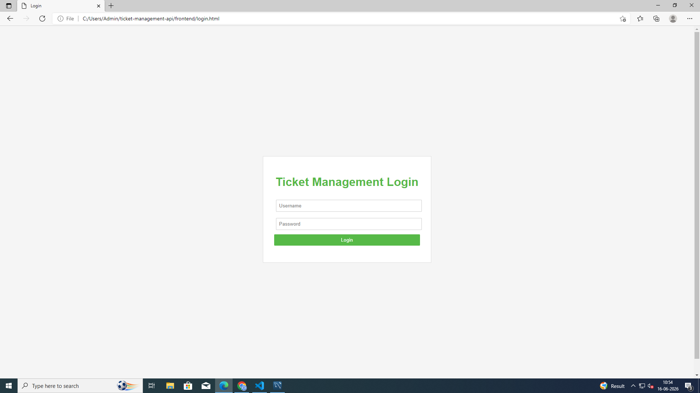
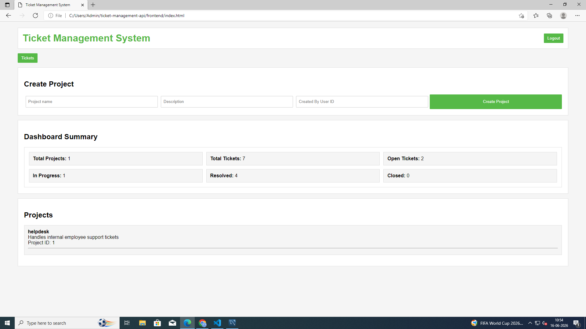
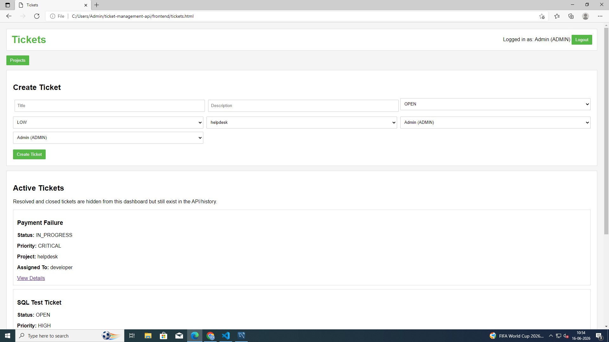
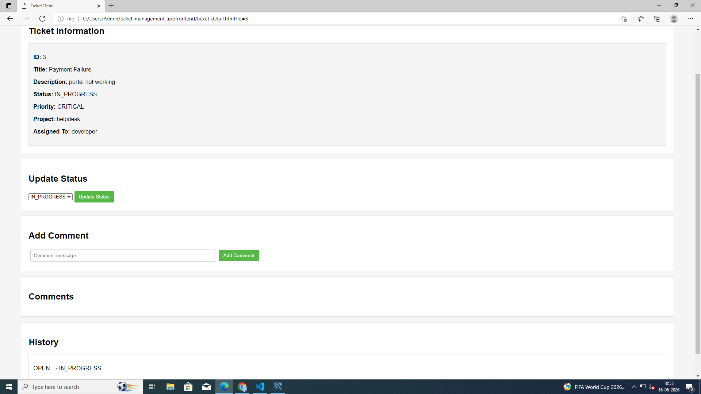

# Ticket Management System

A simple Ticket Management System built using Django and Django REST Framework.

The project allows users to create projects, manage tickets, assign tickets to users, add comments, track ticket history, and monitor ticket status through a dashboard.

## Screenshots

### Login Page

### Dashboard

### Tickets

### Ticket Detail

## Features

* User Authentication using JWT
* Project Management
* Ticket Creation and Assignment
* Ticket Status Tracking
* Comments on Tickets
* Ticket History Tracking
* Dashboard Summary
* Role-Based Access Control
* MySQL Database Support
* Email Notification Integration
* Basic Frontend using HTML, CSS, and JavaScript

## Tech Stack

### Backend

* Python
* Django
* Django REST Framework
* JWT Authentication

### Database

* MySQL
* SQLite (initial development)

### Frontend

* HTML
* CSS
* JavaScript

## Modules

### Projects

* Create projects
* View project list

### Tickets

* Create tickets
* Assign tickets
* Update ticket status
* Track ticket priority

### Comments

* Add comments to tickets
* View ticket discussions

### Ticket History

* Track status changes over time

### Dashboard

* Total Projects
* Total Tickets
* Open Tickets
* In Progress Tickets
* Resolved Tickets
* Closed Tickets

## Learning Outcomes

Through this project, I learned:

* Django project structure
* Django REST Framework
* APIView and ViewSets
* JWT Authentication
* MySQL Integration
* Database Migrations
* Email Integration
* CRUD Operations
* Frontend Development with HTML/CSS
* API Testing and Debugging

## Future Improvements

* Search Tickets
* Ticket Filtering
* Email Alerts on Status Changes
* Better UI Design
* User Profile Management

## Author

Sania Nixon
